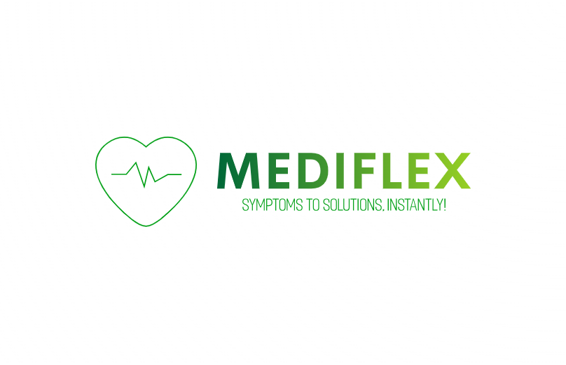

# 💊 MediFlex - Intelligent Medicine Recommendation System

<div align="center">
  
  <p><em>Iot Integrated Smart Medication System Using Machine Learning For Enhanced Rural Healthcare</em></p>
</div>

<div align="center">

[](https://www.python.org/downloads/)
[](https://www.tensorflow.org/)
[](LICENSE)
</div>

<div align="center">
  
  <p><em>Empowering Healthcare Through Technology</em></p>
</div>

---
Visit here: https://moviematch11.streamlit.app/

## 📋 Overview

MediFlex is an **IoT-integrated smart medication system** that leverages **Machine Learning** to enhance healthcare accessibility, particularly in rural and underserved areas. The system employs a **Convolutional Neural Network (CNN)** model to analyze patient symptoms and recommend appropriate medicines with high accuracy, reducing prescription errors and improving patient safety.

### 🎯 Key Features

- **Intelligent Symptom Analysis**: CNN-based model processes 14 unique symptoms to recommend from 5 essential medicines
- **High Accuracy**: Achieves 84.3-86% overall accuracy with AUC-ROC scores of 98-99.3%
- **User-Friendly Interface**: Modern, responsive Streamlit web application
- **Real-time Recommendations**: Instant medicine suggestions based on symptom input
- **Confidence Scoring**: Displays match confidence percentages for each recommendation
- **Educational Tool**: Provides medicine information and safety guidelines

---


## 🏥 Problem Statement

Traditional pharmacy models face several critical challenges:
- Limited accessibility in rural areas (lack of healthcare professionals)
- Short operating hours and logistical inefficiencies
- Human errors in prescription validation
- Medication shortages during emergencies
- Overcrowded urban pharmacies

MediFlex addresses these issues by providing 24/7 automated medication recommendations powered by machine learning.

## 🔬 Research Background

This system is based on research focusing on IoT-integrated smart medication systems for enhanced rural healthcare. The research demonstrates:

- **97.80-99.13% Precision** across different medicine categories
- **94-94.5% Recall** ensuring minimal false negatives
- **Perfect AUC (1.00)** for Azithromycin and Cetirizine classification
- Superior performance compared to Transformer, XLNet, and BiLSTM models

### 📊 Dataset

- **14 Unique Symptoms** mapped to treatment protocols
- **5 Essential Medicines**: Paracetamol, Cetirizine, Azithromycin, Diclofenac, Aciloc
- **Over 14,700+ Reported Cases** used for model training
- **Real-world symptom combinations** ensuring practical applicability

---

## 🛠️ Technology Stack

### Machine Learning
- **Framework**: TensorFlow 2.13.0
- **Model Architecture**: Convolutional Neural Network (CNN)
- **Data Processing**: NumPy, Pandas, Scikit-learn
- **NLP Techniques**: Tokenization, Vectorization


### Additional Libraries
- **Text Processing**: NLTK 3.8.1
- **Data Manipulation**: Pandas 2.0.3, NumPy 1.24.3
- **Model Evaluation**: Scikit-learn 1.3.0

## 📦 Installation

### Prerequisites
- Python 3.10 or higher
- pip package manager
- Virtual environment (recommended)

### Step-by-Step Setup

1. **Clone the Repository**
```bash
git clone https://github.com/Nikhil0-3/MediFlex.git
cd MediFlex
```

2. **Create Virtual Environment**
```bash
python -m venv venv
```

3. **Activate Virtual Environment**
```bash
# Windows
venv\Scripts\activate

# macOS/Linux
source venv/bin/activate
```

4. **Install Dependencies**
```bash
pip install -r requirements.txt
```

## 🚀 Usage

### Running the Application

1. **Start the Streamlit Server**
```bash
streamlit run app.py
```

2. **Access the Application**
- Open your browser and navigate to `http://localhost:8501`
- The application will automatically open in your default browser

### Using the System

#### Step 1: Choose Input Method
- **Text Input**: Type your symptoms naturally
- **Select from List**: Choose from predefined symptom options

#### Step 2: Enter Symptoms
- **Text Input**: Describe your symptoms in natural language
  - Example: "fever, headache, cough, sore throat, body pain"
- **Select from List**: Choose from 18 common symptoms

#### Step 3: Get Recommendations
- Click the "🔍 Get Recommendations" button
- View top recommendations with confidence scores
- See detailed analysis with color-coded confidence levels

#### Step 4: Adjust Settings (Sidebar)
   - **Confidence Threshold**: Set minimum match percentage (10-100%)
   - **Maximum Results**: Control number of recommendations (3-20)
   - **Show All Predictions**: View all results regardless of threshold

## 📁 Project Structure

```
mediflex/
│
├── app.py                          # Main Streamlit application
├── dataset.py                      # Dataset handling and preprocessing
├── graph.py                        # Model evaluation and visualization
├── medi.ipynb                      # Model training notebook
│
├── medicine_model.h5               # Trained CNN model
├── tokenizer.pkl                   # Text tokenizer for symptoms
├── medicine_labels.pkl             # Medicine label encoder
│
├── medicines - modified.csv        # Processed dataset
├── medicines.csv                   # Original dataset
│
├── logo.png                        # Application logo
│
├── requirements.txt                # Python dependencies
├── README.md                       # Project documentation
│
├── ANROID_APP_FILE_MEDIFLEX/      # Android mobile application
│   ├── App_Screenshots/            # Application screenshots
│   │   ├── 1. App_GET_STARTED.png  # Get started screen
│   │   ├── 2. App_SIGN_UP.png      # Sign-up interface
│   │   ├── 3. App_SIGN_IN.png      # Sign-in interface
│   │   └── 4.App_Interface.png     # Web application interface
│   └── MediFlex/                   # Android Studio project
│
└── venv/                          # Virtual environment (not in repo)
```

## 🧠 Model Architecture

### CNN-based Classification System

The system uses a **Convolutional Neural Network** optimized for text-based medical classification:

```python
Sequential([
    Embedding(input_dim=vocab_size, output_dim=16, input_length=5),
    Conv1D(filters=64, kernel_size=3, activation='relu'),
    GlobalMaxPooling1D(),
    Dense(32, activation='relu'),
    Dense(num_medicines, activation='sigmoid')
])
```

### Training Process
- **Input**: Tokenized symptom sequences (max length: 5)
- **Preprocessing**: Text cleaning, normalization, feature extraction
- **Validation**: K-fold cross-validation, dropout regularization
- **Optimization**: Binary cross-entropy loss, Adam optimizer

### Performance Metrics

| Medicine | Precision | Recall | F1-Score | AUC-ROC |
|----------|-----------|--------|----------|---------|
| Paracetamol | 98.00% | 94.00% | 96.00% | 0.98 |
| Cetirizine | 99.00% | 94.50% | 96.70% | 1.00 |
| Azithromycin | 99.13% | 94.50% | 96.76% | 1.00 |
| Diclofenac | 97.80% | 94.00% | 95.86% | 0.99 |
| Aciloc | 98.50% | 94.20% | 96.30% | 0.99 |

## 🎨 Features

### User Interface
- **Modern Design**: Purple gradient theme with intuitive navigation
- **Responsive Layout**: Optimized for desktop and mobile devices
- **Real-time Feedback**: Instant symptom badges and selection counts
- **Visual Analytics**: Progress bars and confidence indicators

### Medicine Recommendations
- **Top Recommendation**: Prominently displayed with confidence percentage
- **Detailed View**: Complete list with color-coded confidence levels
  - 🟢 Green: High confidence (≥70%)
  - 🟡 Yellow: Medium confidence (40-69%)
  - 🟠 Orange: Low confidence (<40%)

### Statistics Dashboard
- Total results count
- High confidence recommendations
- Average match percentage

### Safety Features
- **Medical Disclaimer**: Clear warnings about system limitations
- **Professional Consultation**: Reminder to consult healthcare providers
- **Educational Purpose**: System designed for learning and assistance

---

## 📱 Android Mobile Application

### Features (Upcoming)
- Native Android application for on-the-go access
- User authentication and profile management (See screenshots in Application Screenshots section above)
- Symptom tracking and medication history
- Push notifications for medication reminders
- Offline mode for basic functionality

---
## 📸 Application Screenshots


<div align="center">
  <table>
    <tr>
      <td align="center">
        
        <br/>
        <em>Sign Up Screen</em>
      </td>
      <td align="center">
        
        <br/>
        <em>Sign In Screen</em>
      </td>
      <td align="center">
        
        <br/>
        <em>App Interface</em>
      </td>
      <td align="center">
        
        <br/>
  </table>
</div>

---

## 🔐 System Components (Future IoT Integration)

### Planned IoT Features
1. **Arduino IoT Dispenser**: Automated medication dispensing
2. **Real-time Monitoring**: Stock level tracking and alerts
3. **Sensor Integration**: Temperature, humidity, and fault detection
4. **Mobile Application**: Symptom tracking and medication reminders
5. **OTP Verification**: Secure prescription validation

## 📊 Supported Symptoms & Medicines

### Common Symptoms (14)
- Fever, Headache, Body Pain
- Cold, Allergy, Sneezing, Runny Nose
- Cough, Sore Throat, Bacterial Infection
- Swelling, Inflammation
- Stomach Pain, Acidity

### Recommended Medicines (5)
1. **Paracetamol**: Fever, headache, body pain
2. **Cetirizine**: Allergies, cold symptoms, sneezing
3. **Azithromycin**: Bacterial infections, cough, sore throat
4. **Diclofenac**: Inflammation, swelling, pain relief
5. **Aciloc**: Acidity, stomach pain, gastric issues

## 🔮 Future Enhancements

### Planned Features
- **Blockchain Integration**: Secure prescription history
- **Multilingual Support**: Accessibility for diverse populations
- **Real-time Anomaly Detection**: Prevent fraudulent prescriptions
- **Drug Interaction Alerts**: Enhanced patient safety
- **Predictive Analytics**: Personalized recommendations
- **Telemedicine Integration**: Virtual healthcare consultations
- **Rural Deployment**: Expanding accessibility to remote areas

### Research Directions
- Advanced deep learning architectures
- Integration with Electronic Health Records (EHR)
- Wearable device connectivity
- Real-time health monitoring
- Collaborative filtering for personalized care


## 📄 License

This project is licensed under the MIT License - see the [LICENSE](LICENSE) file for details.

## ⚠️ Disclaimer

**IMPORTANT**: MediFlex is an educational and research tool designed to demonstrate machine learning applications in healthcare. It should **NOT** replace professional medical advice, diagnosis, or treatment.

- Always consult qualified healthcare providers for medical concerns
- Do not use for self-medication or emergency situations
- System recommendations are based on limited symptom data
- Individual medical conditions may require specialized care


## 📞 Contact & Support

For questions, suggestions, or collaboration opportunities:

- **Email**: nikhil.030305@gmail.com
- **GitHub**: [Open an Issue](https://github.com/Nikhil0-3/MediFlex/issues)

---

<div align="center">
  
  <br/>
  <strong>Made with ❤️ by the MediFlex Team</strong>
  <br/>
  <em>Empowering Healthcare Through Technology</em>
  <br/><br/>
</div>
